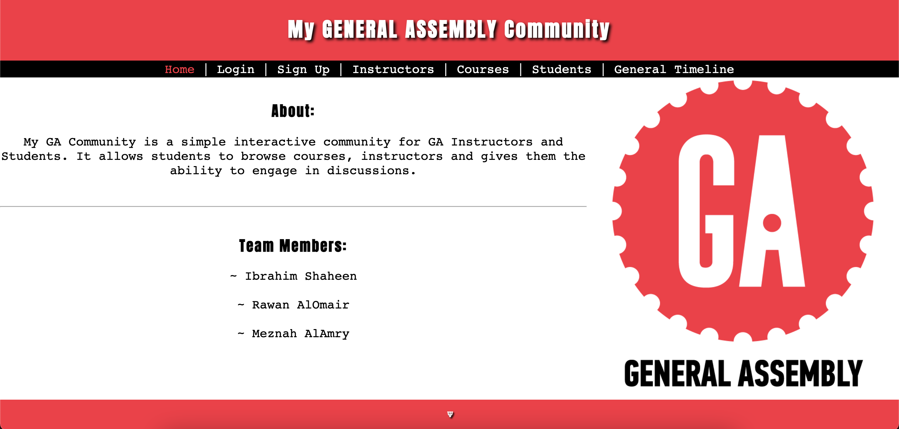

# My-GA-Community
## Description
a Simple Community for GA Instructors and Students. contains profile pages for students and instructors, information pages for GA courses, comment/discussion section and a star rating system for both instructors and courses. It also contains a Timeline that allows registered users to post in.

## Team Members
- Ibrahim Shaheen
- Rawan AlOmair
- Meznah AlAmry

## Wireframes
Click [Here](./assets/wireframes/README.md) to check wireframes

## Progress

### Day-1
- Wireframes ✔︎
- HTML/CSS ×
    * Ibrahim: splash, home, login
    * Rawan: signup, instructors, courses
    * Meznah: students, timeline
- Models ×
    * students.js
        * Full Name
        * Email
        * Password
        * Number
        * Courses: []
    * instructors.js
        * Full Name
        * Hidden Talent
        * Email
        * Password
        * Number
        * Description
        * Rating
    * courses.js
        * Name
        * Length
        * Location
        * Description
- Node/Express Initialization ×
- Current Status:

### Day-2

### Day-3

### Day-4

### Day-5
