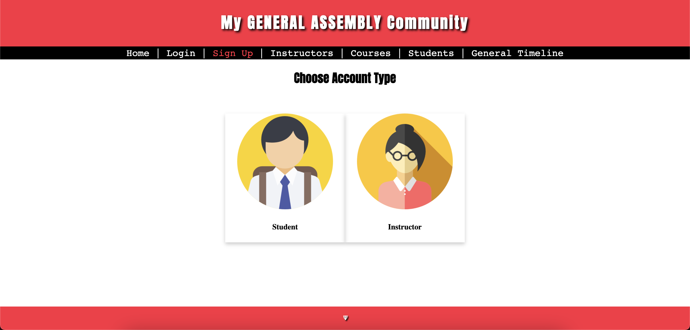
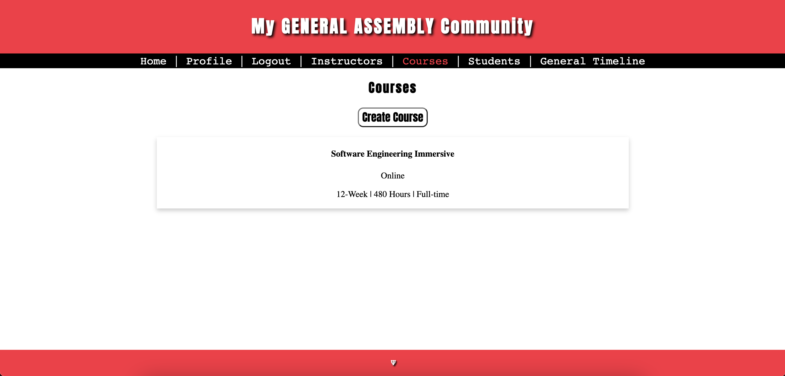
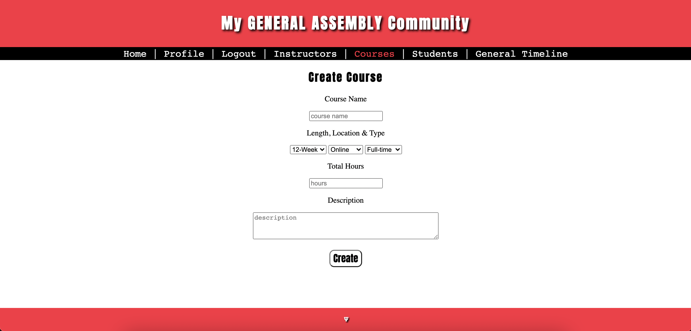
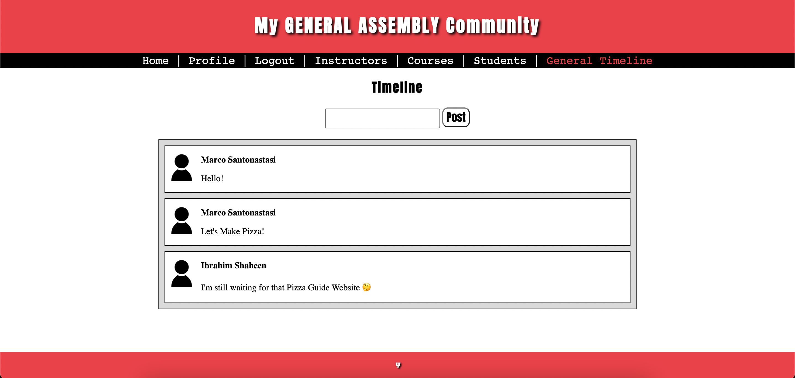
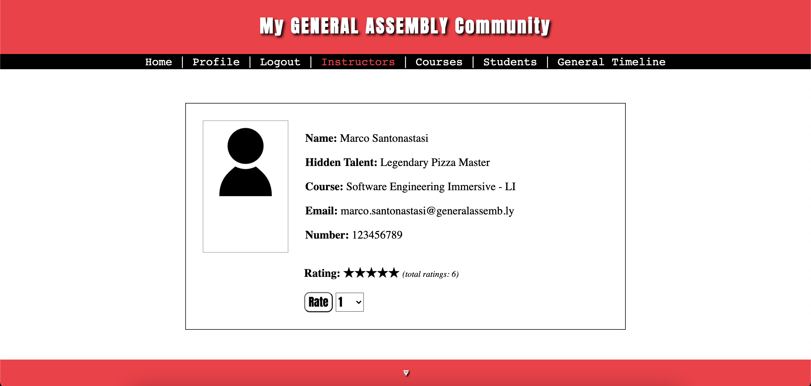

# My-GA-Community
## Description
a Simple Community for GA Instructors and Students. contains profile pages for students and instructors, information pages for GA courses, comment/discussion section and a star rating system for both instructors and courses. It also contains a Timeline that allows registered users to post in.
- Link to [Google Slides](https://docs.google.com/presentation/d/1OOkBWRc8N6cmShxReXiObyZIeOTOQwSKQTyQ-Snjqtw/edit?usp=sharing)
- Link to [Heroku App](https://my-ga-community.herokuapp.com/)

## Team Members
- Ibrahim Shaheen
- Rawan AlOmair
- Meznah AlAmry

## Wireframes
Click [Here](./assets/wireframes/README.md) to check wireframes

## Progress

### Day-1
- Wireframes ✔︎
- HTML/CSS ✔︎
    * Ibrahim: splash, home, login
    * Rawan: signup, instructors, courses
    * Meznah: students, timeline
- Models ✔︎
    * students.js
        * Full Name
        * Email
        * Password
        * Number
        * Courses: []
    * instructors.js
        * Full Name
        * Hidden Talent
        * Email
        * Password
        * Number
        * Description
        * Rating
    * courses.js
        * Name
        * Length
        * Location
        * Description
- Node/Express Initialization ✔︎
- Current Status:

### Day-2
- Login/Sign Up/Logout Functioning ✔︎
- User's Profile ✔︎
- Students Profiles ✔︎
- Sign Up for Instructors ✔︎
- Instructors Profiles ✔︎
- Current Status:

### Day-3
- Instructor Rating System ✔︎
- User Profile (As Instructor) ✔︎
- Create Course ✔︎
- Edit Profile ✔︎
- Edit/Delete Course ✔︎
- Current Status:

### Day-4
- Functioning Timeline ✔︎
- Fixed session bugs ✔︎
- Enhanced profile editing ✔︎
- Current Status:

### Day-5
- Presentation Day
- Link to [Google Slides](https://docs.google.com/presentation/d/1OOkBWRc8N6cmShxReXiObyZIeOTOQwSKQTyQ-Snjqtw/edit?usp=sharing)